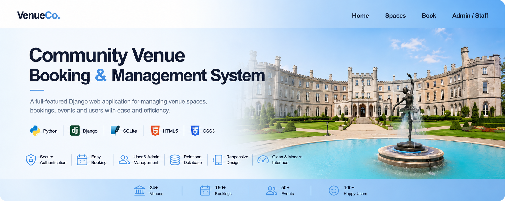
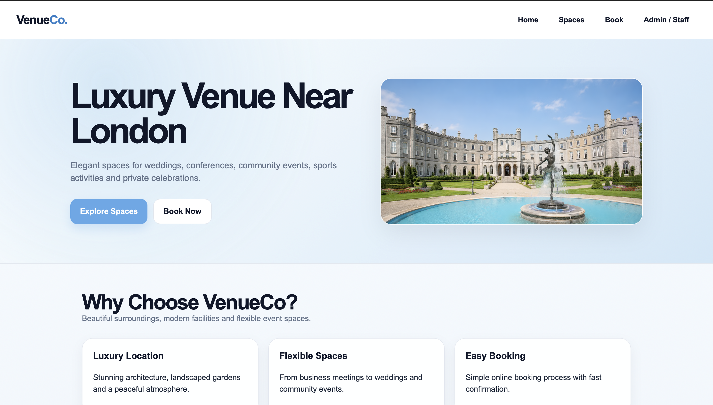
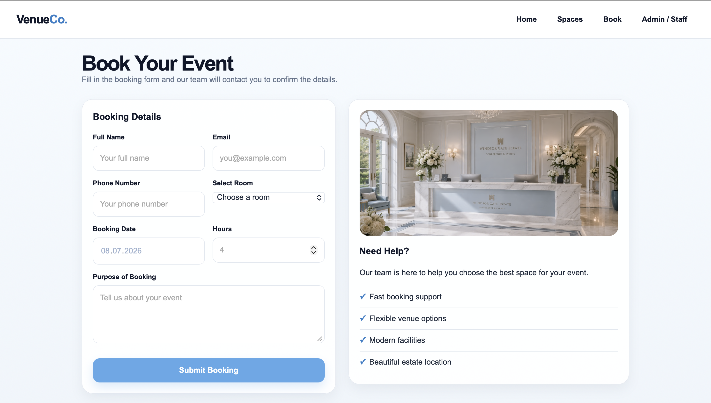
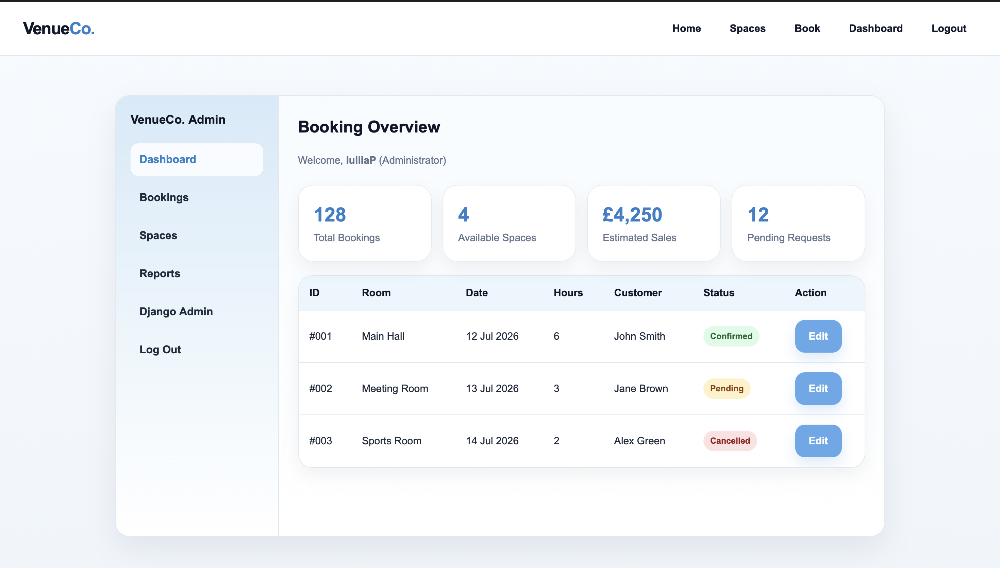
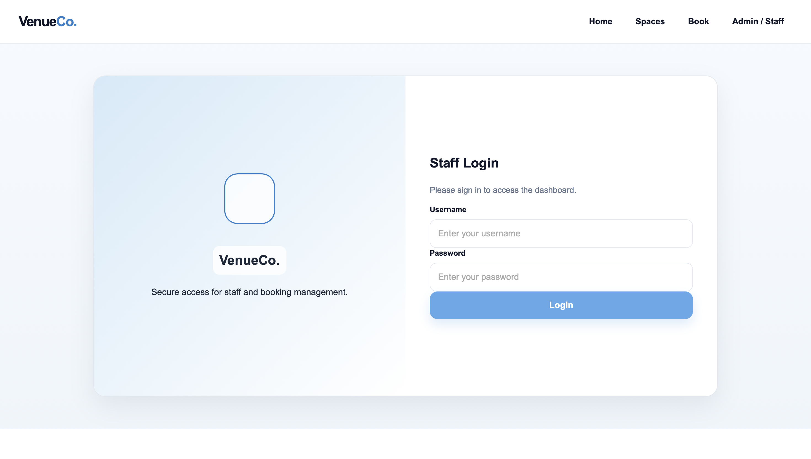
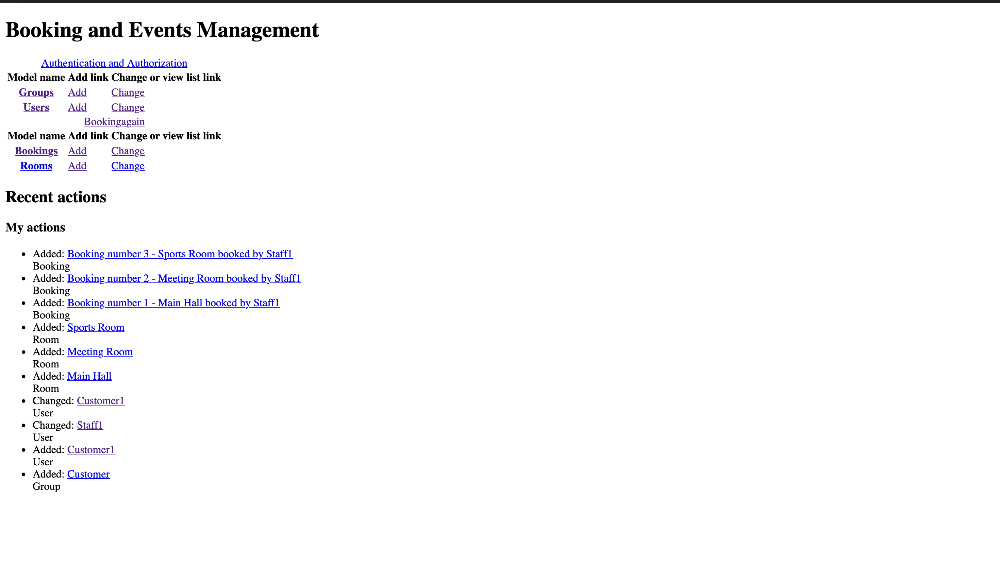
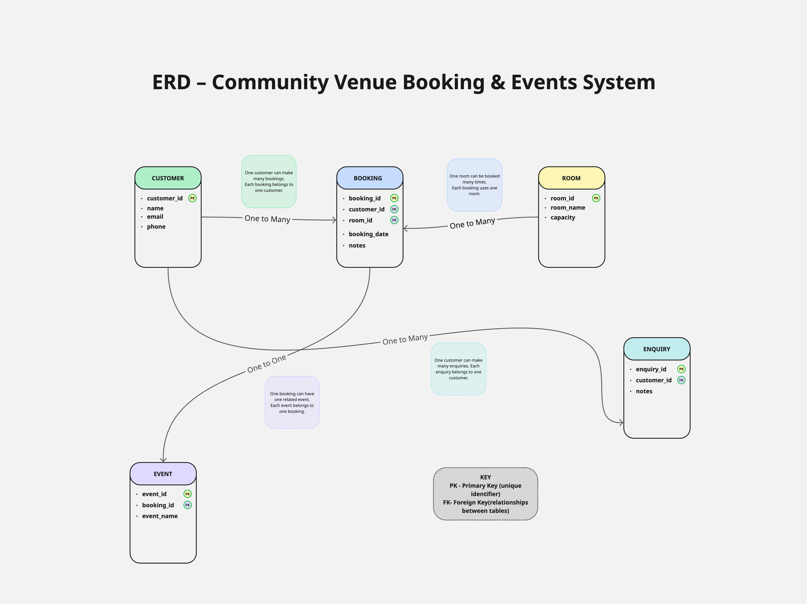

# Community Venue Booking & Management System



A modern **full-stack Django web application** built with **Python**, **Django**, and **SQLite**.


---

# 📖 Overview

Community Venue Booking & Management System is a full-stack Django web application designed to simplify venue reservations and booking management.

Users can browse venues, create bookings and manage reservations, while administrators can efficiently manage data through the Django Admin Panel.

This project demonstrates practical experience in:

- Python
- Django
- SQL
- SQLite
- CRUD Operations
- Authentication
- Database Design
- Responsive Web Development

---

# ✨ Features

- 🔐 User Authentication
- 📅 Booking Management
- 🏛️ Venue Management
- ✏️ CRUD Operations
- 👨‍💼 Django Admin Panel
- 🗄️ SQLite Database
- 📱 Responsive Interface
- 🎨 Clean UI

---

# 📸 Application Preview

## 🏠 Home Page



---

## 📅 Booking Page



---

## 👤 Dashboard



---

## 🔐 Login Page



---

## ⚙️ Django Admin Panel



---

## 🗄️ Database ER Diagram



---

# 🛠️ Tech Stack

| Backend | Frontend | Database | Version Control |
|---------|----------|----------|----------------|
| Python | HTML5 | SQLite | Git |
| Django | CSS3 | SQL | GitHub |

---

# 📂 Project Structure

```text
community-venue-booking-system
│
├── assets
│   └── images
│       ├── banner.png
│       ├── home.png
│       ├── login.png
│       ├── booking.png
│       ├── dashboard.png
│       ├── admin.png
│       └── er-diagram.png
│
├── bookings
├── bookingagain
├── venue_project
├── templates
├── static
├── manage.py
├── requirements.txt
└── README.md
```

---

# 🚀 Installation

Clone the repository

```bash
git clone https://github.com/iuliia-pashkovskaia/community-venue-booking-system.git
```

Go to the project directory

```bash
cd community-venue-booking-system
```

Create a virtual environment

```bash
python -m venv venv
```

Activate it

### macOS / Linux

```bash
source venv/bin/activate
```

### Windows

```bash
venv\Scripts\activate
```

Install dependencies

```bash
pip install -r requirements.txt
```

Run migrations

```bash
python manage.py migrate
```

Start the server

```bash
python manage.py runserver
```

Open your browser

```
http://127.0.0.1:8000/
```

---

# 🎯 Skills Demonstrated

- Full-Stack Web Development
- Django Framework
- Python Programming
- SQL & SQLite
- CRUD Applications
- Authentication
- Database Modelling
- Responsive Design
- Git & GitHub

---

# 🔮 Future Improvements

- Email Notifications
- Calendar Integration
- REST API
- Online Payments
- Search & Filtering
- Automated Testing
- Cloud Deployment

---

# 👩‍💻 Author

## Iuliia Pashkovskaia

**AI Marketing & Automation Specialist**

Python • Django • SQL • AI Agents • Marketing Automation

📧 **Email**

iuliia_pashkovskaia@icloud.com

🌐 **Portfolio**

https://mywebsiteportfoliooo.framer.website

💼 **LinkedIn**

https://www.linkedin.com/in/iuliia-pashkovskaia-4215a736a

---

⭐ If you enjoyed this project, consider giving it a Star!
